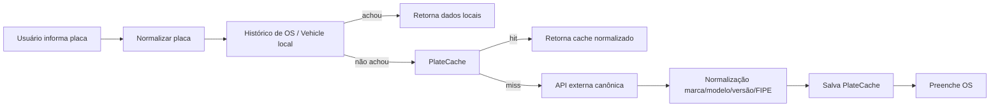
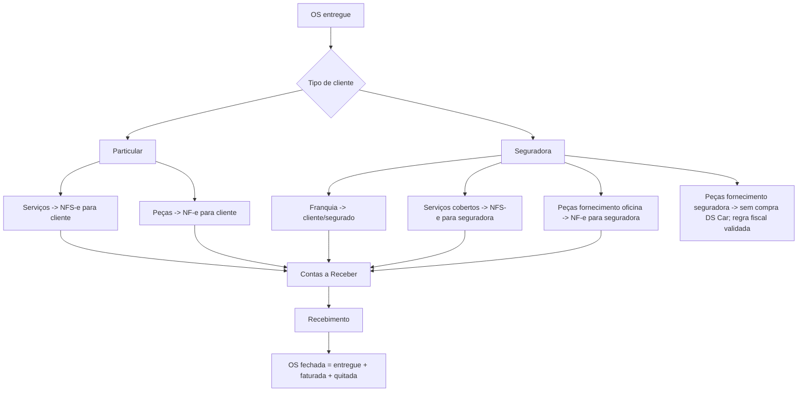

# Plano de Execução MVP — DS Car ERP

> Consolidado em 2026-05-19. Fonte de verdade de escopo: `docs/PRD.md`.
> Objetivo macro: DS Car operar 100% no novo ERP, emitir todas as notas pelo sistema e desligar o legado.

---

## 1. Modo de Trabalho

### Cadência

- Sprint curta de 1 semana para implementação e validação.
- Sprint 0 pode ser mais curta: foco exclusivo em baseline verde e organização.
- Toda sprint começa com objetivo único, backlog fechado e critérios de aceite.
- Toda sprint termina com demo, checklist de qualidade e registro do que ficou pendente.

### Checkpoints fixos

| Momento | Objetivo | Evidência mínima |
|---|---|---|
| Kickoff | Confirmar escopo e riscos | Sprint backlog fechado |
| Meio da sprint | Detectar bloqueios cedo | Lista de itens concluídos, em risco e cortados |
| Pré-demo | Validar fluxo real | Testes/smoke do fluxo principal |
| Fechamento | Decidir se entrega conta como pronta | Checklist de aceite marcado |

### Definition of Done

Um item só entra como concluído quando:

- Código implementado sem quebrar escopo fora do MVP.
- Typecheck/lint/teste relevante executado ou bloqueio registrado.
- Fluxo validado pela UI, API ou teste automatizado.
- Erros de integração não vazam PII nem `str(exc)` para usuário final.
- Documentação operacional atualizada quando a regra de negócio muda.

### Regra de foco

Fica fora do MVP, salvo decisão explícita: motor de precificação, inbox, lojas, hub multi-cliente, RH completo, financeiro avançado, CRM/WhatsApp e IA.

---

## 2. Baseline Atual

### Verificações executadas em 2026-05-19

| Verificação | Resultado | Ação |
|---|---|---|
| `npm run typecheck` | Verde: 7 pacotes com sucesso | Baseline Sprint 0 corrigida |
| `docker compose -f infra/docker/docker-compose.dev.yml exec -T django python manage.py check --settings=config.settings.dev` | Verde: system check sem issues | Usar Docker como referência enquanto `.venv` local estiver quebrado |
| `docker compose -f infra/docker/docker-compose.dev.yml exec -T django pytest --collect-only -q` | Verde: 1115 testes coletados | Coleta corrigida |
| `git status --short` | Worktree contém mudanças não relacionadas | Não reverter; trabalhar com branches/commits cuidadosamente |

### Riscos P0 identificados

| Risco | Impacto | Sprint |
|---|---|---|
| Baseline de qualidade vermelho | Não dá para medir regressão | Sprint 0 |
| Duplicidade na busca de placas (`vehicle_catalog` vs `vehicles`) | Bugs e comportamento divergente | Sprint 1 |
| Documentação diz placa via APIBrasil POST, código usa APIPLACAS GET com token na URL | Integração pode estar errada em produção | Sprint 1 |
| Fiscal cria `FiscalDocument` dentro de transação que pode dar rollback após erro Focus | Perda de trilha de auditoria | Sprint 4 |
| NF-e de OS aceita fallback de `part_number` como NCM | Rejeição fiscal/SEFAZ | Sprint 4 |
| Série DPS da NFS-e Manaus comentada como `2`, mas payload envia `1` | Possível conflito de numeração | Sprint 4 |
| Compra/OC tem semântica potencialmente duplicada entre serviços | Operação de compras inconsistente | Sprint 3 |
| Fechamento de OS depende de faturamento + recebimento + entrega | Regras precisam estar automatizadas e testadas | Sprints 2, 4, 5 |

---

## 3. Mapa Operacional Canônico

### Placa e veículo

Fluxo canônico proposto:

Decisão operacional Sprint 1: o fornecedor canônico de placa para o MVP fica sendo `APIPLACAS_URL`/`APIPLACAS_TOKEN`, atualmente configurado para `wdapi2.com.br`, porque é o contrato ativo no backend, no `.env` e nos testes. A referência antiga a `placa-fipe.apibrasil.com.br` fica registrada como documentação legada até decisão comercial contrária.

### Peças na OS

```mermaid
flowchart TD
  A["Peça necessária na OS"] --> B{"Origem"}
  B --> C["Estoque"]
  B --> D["Compra"]
  B --> E["Seguradora"]
  C --> C1["Reserva UnidadeFisica"]
  C1 --> C2["Baixa por utilização na OS"]
  D --> D1["PedidoCompra"]
  D1 --> D2["OrdemCompra aprovada"]
  D2 --> D3["Recebimento com NF-e ou entrada manual"]
  D3 --> D4["UnidadeFisica vinculada à OS"]
  E --> E1["Aguardando seguradora"]
  E1 --> E2["Não gera compra DS Car"]
  E2 --> E3["Pode compor cobrança conforme regra fiscal"]
```

Regra: `fornecimento/origem` é atributo da peça, não da OS inteira.

### Pedido de compra vs Ordem de compra

- `PedidoCompra`: solicitação operacional de uma peça específica da OS. Nasce quando uma `ServiceOrderPart` tem `origem="compra"` e precisa de cotação/comprador. Ela responde “o que precisa ser comprado para esta OS?”.
- `OrdemCompra`: documento financeiro/gerencial que agrupa um ou mais pedidos ou itens avulsos para aprovação. Ela responde “o que a DS Car está autorizando comprar, de qual fornecedor e por qual valor?”.
- `ItemOrdemCompra`: linha aprovada/recebida dentro da OC. No recebimento, gera `UnidadeFisica`, `MovimentacaoEstoque(ENTRADA_NF)` e, quando o destino é `os_direta`, reserva a unidade para a OS e atualiza a peça vinculada.
- AP nasce na aprovação da `OrdemCompra`; estoque nasce no recebimento físico/fiscal do item. Aprovar compra não preenche `custo_real` da peça, porque custo real só existe quando a peça chega com valor de NF.

### Faturamento

---

## 4. Roadmap de Sprints do MVP

### Sprint 0 — Baseline Verde e Governança

**Objetivo:** tornar o repositório confiável para evoluir: typecheck, check Django e coleta de testes devem ter baseline conhecido.

**Escopo P0**

- Corrigir export duplicado em `packages/types`.
- Adicionar/alinhar dependências faltantes (`rest_framework_nested`, `respx`) nos requirements corretos.
- Resolver conflito de coleta `apps/service_orders/tests.py` vs `apps/service_orders/tests/`.
- Criar comando rápido de verificação do MVP: backend check, coleta pytest, typecheck de packages e web.
- Marcar módulos fora do MVP como congelados no plano.

**Checkpoints**

- `npm run typecheck` não falha em packages compartilhados.
- `manage.py check --settings=config.settings.dev` passa.
- `pytest --collect-only -q` coleta sem erro.
- Documento de baseline atualizado com qualquer teste ainda vermelho.

**Meta de saída:** ambiente de desenvolvimento com sinais mínimos verdes.

**Comando de baseline:** `make sprint-baseline`

---

### Sprint 1 — Placas, Cadastros e Identidade Operacional

**Objetivo:** consolidar placa/veículo/cliente para que abertura de OS seja estável.

**Escopo P0**

- Escolher uma integração canônica de placa e remover duplicidade operacional entre `vehicle_catalog` e `vehicles`.
- Corrigir cache de placas para devolver os mesmos campos da primeira consulta.
- Corrigir uso de versão FIPE em veículo existente.
- Trocar hardcode de backend no proxy web por configuração.
- Validar fluxo: placa -> cliente/veículo -> abertura de OS.
- Revisar vínculo `Person`, `UnifiedCustomer`, `Vehicle` e seguradora para emissão fiscal futura.

**Checkpoints**

- Busca de placa manual no web funcionando.
- Busca de placa no mobile funcionando com cache local.
- Teste unitário ou API test cobrindo cache hit e API miss.
- Decisão documentada sobre fornecedor de placa.

**Meta de saída:** recepção consegue abrir OS sem retrabalho manual de veículo.

---

### Sprint 2 — Pipeline OS Particular + Seguradora

**Objetivo:** validar o ciclo real da OS nos dois caminhos principais.

**Escopo P0**

- Garantir criação de OS por cadastro direto, particular e sinistro Cilia.
- Validar transições dos 17 status no backend e frontend.
- Fechar lacunas de soft/hard blocks para vistoria, fotos, assinatura, peças, faturamento e entrega.
- Executar ou finalizar o E2E de pipeline particular + seguradora.
- Atualizar manual operacional da OS com decisões reais.

**Checkpoints**

- OS particular passa de recepção até entregue em ambiente dev.
- OS seguradora passa de importação/autorização até entregue em ambiente dev.
- Transições terminais `delivered` e `cancelled` bloqueiam saída.
- E2E ou roteiro manual com evidências salvo.

**Meta de saída:** a equipe entende e consegue operar a jornada da OS.

---

### Sprint 3 — Estoque, Compras e Fornecimento de Peças

**Objetivo:** deixar clara e funcional a diferença entre estoque, compra e fornecimento de seguradora.

**Escopo P0**

- Consolidar semântica de `PedidoCompra` vs `OrdemCompra`.
- Garantir um caminho único: sem estoque -> PedidoCompra -> OrdemCompra -> recebimento -> reserva para OS.
- Validar reserva/baixa com `select_for_update` e saldo nunca negativo.
- Garantir que peça fornecida pela seguradora não gera compra DS Car.
- Conferir vínculo entre NF-e recebida, estoque e contas a pagar.
- Corrigir inconsistências entre serviços de compras que criam OC por OS vs por fornecedor.

**Checkpoints**

- Peça em estoque é reservada e utilizada na OS.
- Peça sem estoque gera compra aprovada e depois entra no estoque.
- Peça de seguradora aparece como aguardando seguradora e não gera OC.
- NF-e de entrada pode gerar estoque e AP de forma idempotente.

**Meta de saída:** peças deixam de ser texto em orçamento e passam a ter vida logística rastreável.

---

### Sprint 4 — Fiscal e Faturamento

**Objetivo:** emitir documentos fiscais corretos por cenário operacional.

**Escopo P0**

- Corrigir validação de NCM: NF-e de peças exige NCM 8 dígitos válido, sem fallback para `part_number`.
- Revisar série DPS da NFS-e Manaus.
- Garantir destinatário correto: cliente, seguradora ou segurado conforme categoria.
- Separar regra de faturamento direto de OS e regra de faturamento consolidado via billing.
- Garantir trilha de auditoria fiscal mesmo quando a Focus rejeita payload.
- Confirmar armazenamento de XML/PDF autorizado conforme requisito S3.
- Validar cancelamento, consulta/polling e manifestação de NF-e recebida.

**Checkpoints**

- NFS-e de serviços particular emitida em homologação ou mock Focus.
- NF-e de peças particular emitida em homologação ou mock Focus.
- Faturamento de seguradora separa franquia, serviços e peças.
- Rejeição Focus gera erro amigável e rastro auditável.

**Meta de saída:** administrativo consegue faturar uma OS sem sair do ERP.

---

### Sprint 5 — Financeiro, Contábil e Fechamento de OS

**Objetivo:** fechar a OS com verdade financeira: entregue, faturada e quitada.

**Escopo P0**

- Validar criação de AR a partir do faturamento.
- Validar criação de AP a partir de compras/NF-e entrada.
- Registrar recebimentos/pagamentos parciais e totais.
- Corrigir lançamento contábil automático de receita, CMV, AP e AR.
- Garantir indicador de OS fechada: entregue + faturada + quitada.
- Garantir bloqueio de edição financeira após faturamento.

**Checkpoints**

- OS faturada gera contas a receber.
- Recebimento total marca OS como quitada.
- Pagamento de AP lança contábil corretamente.
- Dashboard financeiro básico reflete pendências reais.

**Meta de saída:** dono consegue saber o que foi entregue, faturado e recebido.

---

### Sprint 6 — Mobile de Pátio, Fotos, Assinaturas e Offline

**Objetivo:** tornar o mobile/tablet suficiente para a operação de oficina.

**Escopo P0**

- Apontamento por etapa com executor, texto, foto e timestamp.
- Vistoria inicial/final com foto e assinatura do cliente.
- Marca d'água local nas fotos antes do upload.
- Assinatura de funcionário/CEO reaproveitada em documentos quando aplicável.
- Sincronização offline mínima: capturar offline, sincronizar quando voltar conexão, mostrar pendências.
- Validar que fotos de OS são imutáveis com soft delete.

**Checkpoints**

- Chefe de oficina consegue registrar apontamento completo no mobile.
- Foto offline sincroniza posteriormente.
- Assinatura via canvas salva e aparece no documento/vistoria.
- App não quebra quando API está indisponível temporariamente.

**Meta de saída:** o pátio não depende do web para registrar execução.

---

### Sprint 7 — Migração, Pré-Produção e Segurança

**Objetivo:** preparar o corte do legado para produção controlada.

**Escopo P0**

- Rodar ETL do legado: 10k OS e 7k clientes.
- Validar amostra de dados migrados com usuários reais.
- Conferir Keycloak produção, tenants, domínios, secrets e RBAC.
- Configurar backups diários, Sentry e logs sem PII.
- Validar certificado fiscal, Focus produção/homologação e dados SEFAZ.
- Preparar checklist de go-live e rollback operacional.

**Checkpoints**

- Migração roda do zero em ambiente limpo.
- Usuários reais conseguem logar com papéis corretos.
- Backups e restore testados.
- Smoke fiscal em homologação aprovado.

**Meta de saída:** ambiente pronto para piloto real.

---

### Sprint 8 — Piloto Operacional e Corte do Legado

**Objetivo:** operar com a DS Car em produção assistida.

**Escopo P0**

- Escolher janela de piloto com conjunto limitado de OS novas.
- Acompanhar recepção, pátio, estoque/compras, fiscal e financeiro.
- Registrar bugs por severidade e corrigir P0/P1 diariamente.
- Produzir manual curto de operação por papel.
- Decidir corte total do legado após critérios objetivos.

**Checkpoints**

- Pelo menos 1 OS particular completa no novo sistema.
- Pelo menos 1 OS seguradora completa no novo sistema.
- Pelo menos 1 compra vinculada à OS validada.
- Pelo menos 1 emissão fiscal por tipo aplicável validada.
- OS fechada aparece corretamente como entregue + faturada + quitada.

**Meta de saída:** decisão formal de desligar ou manter paralelo por período definido.

---

## 5. Métricas de Progresso

### Métricas técnicas

- Typecheck verde.
- Django check verde.
- Coleta de testes sem erro.
- Testes críticos por domínio passando: OS, fiscal, estoque, compras, financeiro.
- E2E do pipeline OS particular/seguradora passando ou roteiro manual assinado.

### Métricas operacionais

- Tempo de abertura de OS.
- Percentual de OS com placa/cliente/veículo completos.
- Percentual de peças com origem definida.
- Percentual de OS entregues com NF emitida.
- Percentual de OS entregues/faturadas/quitadas.
- Pendências de sincronização mobile.

### Métricas de qualidade fiscal/financeira

- NF rejeitada por NCM/cadastro.
- NF pendente de polling há mais de 30 minutos.
- AR vencido sem baixa.
- AP gerado sem vínculo com compra/NF-e.
- Lançamento contábil desbalanceado: deve ser zero.

---

## 6. Backlog P0 por Domínio

### Qualidade e infraestrutura

- [x] Resolver `npm run typecheck` do monorepo.
- [x] Resolver dependências faltantes do backend.
- [x] Resolver coleta de testes.
- [x] Criar comando/checklist de baseline de sprint.

### Placas e cadastros

- [x] Definir fornecedor oficial de placa.
- [x] Consolidar implementação de placa.
- [x] Corrigir retorno de cache.
- [x] Corrigir versão FIPE em veículo existente.
- [x] Trocar hardcode de backend no proxy web por configuração.
- [x] Adicionar teste API para cache hit e DB-first de placa.
- [x] Garantir vínculo fiscal de cliente/seguradora com `Person`.

### OS

- [x] Validar OS particular completa.
- [x] Validar OS seguradora completa.
- [x] Validar Cilia importando OS em `waiting_auth`.
- [x] Validar bloqueios de transição.
- [x] Validar histórico imutável de status.

### Estoque e compras

- [x] Documentar e corrigir diferença `PedidoCompra` vs `OrdemCompra`.
- [x] Garantir fluxo estoque -> reserva -> utilização.
- [x] Garantir fluxo compra -> recebimento -> estoque -> OS.
- [x] Garantir peça seguradora sem compra DS Car.
- [x] Garantir AP a partir de NF-e/compra quando aplicável.

### Fiscal e faturamento

- [x] Validar NCM 8 dígitos na NF-e.
- [x] Revisar série DPS NFS-e Manaus.
- [x] Garantir auditoria de rejeição Focus.
- [x] Garantir XML/PDF autorizado armazenado.
- [x] Validar seguradora, cliente e franquia.

### Financeiro e contábil

- [x] Garantir AR por faturamento.
- [x] Garantir AP por compra/NF-e entrada.
- [x] Garantir recebimento/pagamento parcial.
- [x] Garantir lançamento contábil correto.
- [x] Garantir OS fechada somente com 3 condições.

### Mobile

- [ ] Validar apontamento com foto.
- [ ] Validar vistoria com assinatura.
- [ ] Validar marca d'água local.
- [ ] Validar offline/sync mínimo.
- [ ] Validar soft delete de foto.

---

## 7. Perguntas de Decisão

1. A sprint será semanal mesmo, ou prefere ciclos de 2 semanas?
2. Qual fornecedor oficial de consulta de placa vamos usar no MVP?
3. O MVP exige offline completo no mobile ou captura offline com sync posterior já basta?
4. A franquia do segurado deve virar NFC-e obrigatória no MVP ou pode começar como recebível manual com emissão assistida?
5. A DS Car vai emitir por um único CNPJ no MVP ou precisa preparar multi-CNPJ desde o piloto?

---

## 8. Próxima Ação Recomendada

Executar Sprint 0 antes de qualquer feature:

1. Corrigir baseline técnico.
2. Criar checklist de verificação rápida.
3. Reexecutar checks.
4. Só então abrir Sprint 1 de placa/cadastros.

Isso evita construir o restante em cima de sinais vermelhos e deixa cada sprint mensurável.
